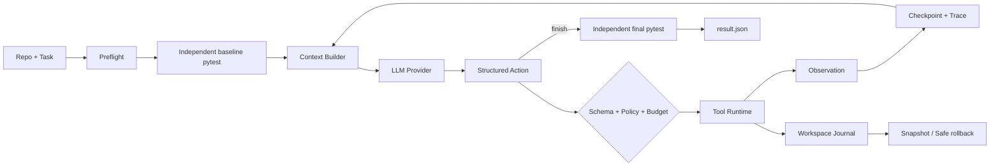

# RepoFix-Harness

[](https://github.com/ztsstz711-afk/RepoFix-Harness/actions/workflows/ci.yml)


面向 Python Repository Bug Repair 的 Coding Agent Harness。输入一个代码仓库和修复任务，真实 LLM 自主完成：

```text
inspect → run pytest → read/search code → apply patch → verify → finish
```

RepoFix 不是聊天界面，也不是通过规则假装 Agent。模型负责选择动作和生成修改；Harness 负责上下文、工具、权限、预算、状态恢复、执行隔离、轨迹记录和独立验收。

> 当前版本：`v4.8.0` · 自动测试：`282 passed` · 默认模型：`deepseek-v4-flash`

## 运行效果

```text
Task: Fix the failing optional configuration override behavior.

Baseline       FAILED  1 failed, 4 passed
Step 1         read(config_loader.py)
Step 2         apply_patch(config_loader.py)
Post-patch     PASSED  5 passed
Final          PASSED  5 passed

Status         SUCCESS
Changed files  config_loader.py
Scope match    true
```

成功状态不由模型的 `finish` 决定。即使模型声称修复完成，Harness 仍会运行独立 final pytest，并检查实际 Git 改动范围。

## 系统架构



| 层 | 职责 |
|---|---|
| Agent Loop | 维护状态机、终止条件、repair phase 与 checkpoint/resume |
| Context | 注入 baseline、traceback 源码、导航记忆和当前 revision working set |
| Provider | OpenAI-compatible API、Function Calling、JSON fallback 和有界重试 |
| Tool Runtime | `list`、`search`、`read`、`apply_patch`、`run_command`、`git_diff/status` |
| Safety | 路径边界、pytest-only 命令、改动文件上限、重复动作和预算控制 |
| Verification | 独立 baseline/final pytest、改动范围检查、Docker 运行时指纹 |
| Evaluation | 隔离 trial、重复实验、断点续跑、完整性校验和模型对照 |

更完整的数据流与信任边界见 [Architecture](docs/architecture.md)。

## 核心能力

- 真实单 Agent 闭环，而不是固定的“先检索、再回答”流程
- 工具由中央 JSON Schema 注册，同时约束原生 Function Calling 和 fallback 输出
- 基于 pytest traceback、local import 和有限 call expansion 构建首轮上下文
- 请求、token、step、输出长度和估算成本均有硬预算
- 每一步原子保存 trace；中断后可校验任务身份并继续同一个 run
- 文件写入前记录原始字节与哈希，失败后支持冲突安全回滚
- Docker pytest 禁网、只读挂载、只读根文件系统、无提权并限制 CPU/内存/PID
- 模型不能直接运行任意 shell，命令工具只接受安全解析后的 pytest 调用
- `finish`、预算耗尽或 Provider 输出异常后，都由 Harness 独立决定是否验收成功
- Evaluation 报告会重算聚合值并保存 manifest、源码、Harness 和 Docker 指纹

## 快速开始

### 1. 安装

```powershell
git clone https://github.com/ztsstz711-afk/RepoFix-Harness.git
cd RepoFix-Harness
powershell -ExecutionPolicy Bypass -File .\scripts\setup_project.ps1 -BuildSandbox
.\.venv\Scripts\Activate.ps1
```

要求：Python 3.10+、Git；外部仓库推荐安装并启动 Docker Desktop。

### 2. 配置真实模型

DeepSeek 配置脚本会隐藏读取 API Key，并保存为当前用户环境变量，不会写入仓库：

```powershell
.\scripts\setup_deepseek.ps1
```

Provider 使用 OpenAI-compatible 接口，也可通过以下环境变量切换其他服务：

```text
REPOFIX_BASE_URL
REPOFIX_API_KEY
REPOFIX_MODEL
```

不要把密钥写入代码、README、evaluation manifest 或提交记录。

### 3. 运行隔离演示

```powershell
.\scripts\run_demo.ps1
```

直接修复指定仓库：

```powershell
repofix --repo <python-repo> `
  --task "Fix the failing tests" `
  --execution-backend docker `
  --max-requests 8 `
  --max-tokens 20000
```

如果目标项目的快速测试和最终验收不同：

```powershell
repofix --repo <python-repo> `
  --task "Fix the parser regression" `
  --test-command "pytest -q tests/parser/test_regression.py" `
  --final-test-command "pytest -q tests" `
  --verify-after-patch `
  --execution-backend docker
```

## 命令行入口

| Command | Purpose |
|---|---|
| `repofix` | 运行单个真实修复任务 |
| `repofix-doctor` | 不调用模型，检查仓库、pytest、Git 和 Docker 条件 |
| `repofix-eval` | 在隔离副本中运行 JSON evaluation suite |
| `repofix-compare` | 严格校验身份后比较两份 evaluation report |
| `repofix-runs` | 查询、查看或安全回滚历史 run |

单次任务会在目标仓库生成以下本地控制文件：

```text
.repofix/
├── trace.json
├── result.json
└── runs/<run_id>/
    ├── trace.json
    ├── result.json
    └── workspace/
        ├── manifest.json
        └── backups/*.bin
```

`.repofix/`、真实 API 评测输出和外部 benchmark 工作区均被 Git 忽略。

## 真实评测摘要

| Gate | Contract | Result |
|---|---|---|
| V4.8 breadth | 5 个真实项目、9 个已知上游 Bug × 3 trials，冻结预算与 Docker 验收 | 22/27 verified；成功项精确范围 22/22；191 requests，$0.2684 |
| V4.7 Flash/Pro | 同一 Harness、manifest、源码与 Docker；3 个小型 case | 两组均 3/3；Pro requests -27.27%、tokens -38.61%，成本 +94.61% |
| V4.2 cross-project | 3 个 checksum-qualified 上游 Bug × 3 trials | 9/9 verified，9/9 精确范围，0 retries |
| V2.0 stability | 3 个难度不同的上游 Bug × 3 trials | 4/9 verified，保留失败结果作为能力边界 |
| V1.3 context A/B | 5 类 Bug，context on/off 各 15 trials | 两组均 15/15；context-on 平均 requests -23.81%、tokens -22.80% |

这些数字用于验证 Harness 机制，不等同于 SWE-bench，也不代表任意真实仓库上的成功率。项目保留失败门禁和反例，不通过挑选重跑拼接结论。

重点结果：

- [V4.8 五项目二十七次广度回归](docs/v4.8-breadth-regression-results.md)
- [V4.7 原生 Flash/Pro 阶段归因对照](docs/v4.7-native-phase-model-comparison.md)
- [V4.2 跨项目 target-read 回归](docs/v4.2-target-read-regression.md)
- [V2.0 三案例九次稳定性门禁](docs/v2.0-stability-results.md)
- [V1.3 五场景 context A/B](docs/v1.3-context-matrix-results.md)
- [V1.5 真实上游 Bug suite 设计](docs/v1.5-upstream-bug-suite.md)
- [完整 Changelog](CHANGELOG.md)

## Repository layout

```text
repofix/       Agent Loop、Provider、Context、Tools、Safety 与 Evaluation
tests/         不调用真实 API 的单元/集成测试
examples/      可重复的 buggy Python fixtures
evals/         有界 evaluation manifests
sandbox/       受限 pytest Docker image
scripts/       安装、Provider 配置与 benchmark 准备脚本
docs/          架构、实验合同、结果与面试讲解
```

## 安全边界

Docker 只隔离目标仓库的 pytest 执行。Harness 本身和 Agent 文件写入仍运行在宿主机，因此它不是完整操作系统沙箱。

对不可信仓库：

1. 使用 `--execution-backend docker`；
2. 先运行 `repofix-doctor`；
3. 在独立 Git worktree 或临时副本中运行；
4. 设置合理的 request/token/changed-file 上限；
5. 在提交前人工审查最终 diff。

## 非目标

当前不做 LangGraph、multi-agent、MCP、Web UI、任意 shell、完整 Dockerized Harness 或 SWE-bench 全量接入。项目使用可审查的 Python 状态机，重点展示 Coding Agent 的控制层、信任边界与可复现实验。

## License

[MIT](LICENSE)
