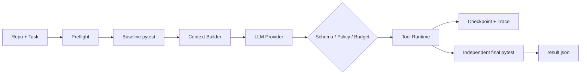

# RepoFix-Harness

[](https://github.com/ztsstz711-afk/RepoFix-Harness/actions/workflows/ci.yml)


面向 Python 仓库 Bug Repair 的 Coding Agent Harness。模型负责理解任务、选择工具和生成补丁；Harness 负责限制动作、保存状态、隔离测试、校验修改范围，并以独立 pytest 决定是否真的修复成功。

```text
Repo + repair task
  -> preflight
  -> independent baseline pytest
  -> context + bounded model action
  -> safe tool runtime
  -> checkpoint / trace
  -> independent final pytest + changed-file check
  -> verified success or preserved failure
```

## 核心设计


```mermaid
flowchart LR
    U[Repo + Task] --> P[Preflight]
    P --> B[Baseline pytest]
    B --> C[Context Builder]
    C --> L[LLM Provider]
    L --> G{Schema / Policy / Budget}
    G --> T[Tool Runtime]
    T --> S[Checkpoint + Trace]
    T --> V[Independent final pytest]
    V --> R[result.json]
```

- **真实 Agent 闭环**：模型选择 `list/search/read/apply_patch/run_command` 等受限动作，而非固定脚本式修复。
- **独立验收**：模型的 `finish` 不代表成功；Harness 重跑 final pytest，并检查实际改动文件范围。
- **有界执行**：请求数、token、步骤数、输出长度、可改文件数与可执行命令均有限制。
- **可恢复状态**：原子 trace、工作区 journal、checkpoint 与冲突安全回滚使中断可审计。
- **受限测试环境**：Docker pytest 可禁网、只读挂载、只读根文件系统并限制资源。

## 当前验证状态

本机验证已完成：非 Docker 测试为 `279 passed`；Docker Linux engine 与 `repofix-pytest:latest` 镜像就绪后，4 个真实容器隔离场景为 `4 passed`。这些测试覆盖受限容器边界、超时容器清理、`src/` 布局支持和隔离修复场景；它们只验证 Harness 的现有执行控制，不代表模型在任意仓库上的修复成功率。

## 快速开始

```powershell
git clone https://github.com/ztsstz711-afk/RepoFix-Harness.git
cd RepoFix-Harness
powershell -ExecutionPolicy Bypass -File .\scripts\setup_project.ps1 -BuildSandbox
.\.venv\Scripts\Activate.ps1
```

配置 OpenAI-compatible provider 后运行隔离演示：

```powershell
.\scripts\setup_deepseek.ps1
.\scripts\run_demo.ps1
```

或对指定 Python 仓库运行：

```powershell
repofix --repo <python-repo> `
  --task "Fix the failing tests" `
  --execution-backend docker `
  --max-requests 8 `
  --max-tokens 20000
```

## 命令行入口

| Command | Purpose |
| --- | --- |
| `repofix` | 运行一个有界修复任务 |
| `repofix-doctor` | 不调用模型，检查 Git、pytest 与 Docker 前置条件 |
| `repofix-eval` | 在隔离副本中执行冻结评测清单 |
| `repofix-compare` | 在身份一致后比较两份评测报告 |
| `repofix-runs` | 查看、续跑或安全回滚历史运行 |

## 评测原则

公开评测只使用冻结任务、独立 baseline/final pytest、明确的改动范围 oracle 和完整 report/manifest 对应关系。失败任务不替换、不选择性重跑，也不在结果出现后增加预算。

历史过程与原始模型轨迹不作为 GitHub 展示内容。最终公开结果只会在 manifest、原始 report、运行环境与源码版本可以一一对应时出现；因此仓库不把“模型说修好了”当作项目指标。

## 仓库结构

```text
repofix/   Agent loop、provider、context、tool policy、workspace 与 evaluation
tests/     不调用真实 API 的单元与集成测试
evals/     冻结的评测 manifest
sandbox/   受限 pytest Docker image
scripts/   环境、provider 与评测准备脚本
docs/      架构和最终展示说明
```

## 安全边界

Docker 只隔离目标仓库中的 pytest 执行；Harness 本身与 Agent 写入仍在宿主机。因此对不可信仓库，应在独立 worktree 或临时副本中运行，先执行 `repofix-doctor`，并在提交前人工审查最终 diff。

## 非目标

- 不用多 Agent、MCP、长期记忆或 UI 堆叠代替可验证的修复闭环；
- 不允许任意 shell；
- 不把小型自定义评测写成 SWE-bench 或任意仓库上的成功率；
- 不上传原始模型轨迹、外部 benchmark 工作区、密钥或过程性版本记录。
