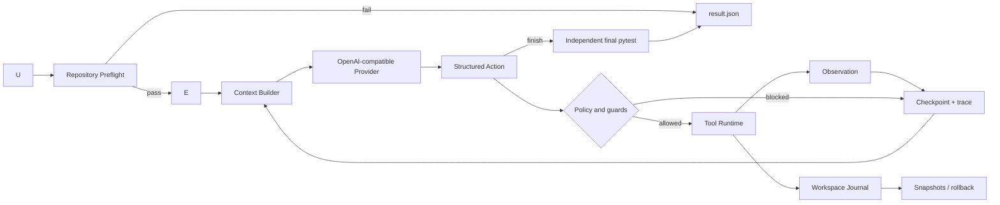

# Architecture

## End-to-end flow



模型只负责选择 action 和生成局部或完整文件修改。Harness 决定模型能看到什么、动作是否合法、工具如何执行、何时停止，以及结果是否可信。

## Module map

| Module | Responsibility |
|---|---|
| `loop.py` | Agent 状态机、终止条件、checkpoint 和事件流 |
| `provider.py` | OpenAI-compatible API、原生 Function Calling、JSON fallback、阶段工具策略和格式/网络重试 |
| `context.py` | 有界 prompt、独立 baseline、导航记忆、repair phase 和下一动作优先级 |
| `failure_context.py` | 从 baseline traceback 安全提取仓库内源码位置与有界行号片段 |
| `registry.py` | 单一 action schema 来源和参数验证 |
| `permissions.py` | 仓库路径、控制目录和 pytest 参数边界 |
| `tools.py` | 文件、搜索、局部/整文件 patch、pytest 和 Git 工具执行 |
| `workspace.py` | 写前快照、结束哈希、冲突检测和恢复 |
| `budget.py` | request/token 预算、价格估算和 provider 错误分类 |
| `evaluation.py` | 使用持久化验证命令独立运行 baseline/final/post-rollback pytest |
| `storage.py` | 原子保存 latest 与 per-run trace/result |
| `suite.py` | 隔离复制、交错重复 trial、失败隔离、配对统计、实验指纹和聚合报告 |
| `reporting.py` | 将稳定的 evaluation JSON 字段渲染为便于审阅的 Markdown 摘要 |
| `run_manager.py` | 历史 run 查询和事后安全回滚 |
| `preflight.py` | 模型调用前检查解释器、pytest、命令和仓库形态 |
| `execution.py` | 本地或受限 Docker pytest 执行后端 |
| `presentation.py` | 单任务实时进度和 outcome-first 最终摘要 |

## State transitions

```text
running
├── preflight_failed      local environment or verification contract invalid
├── success               final pytest passed after finish
├── verification_failed   model finished but final pytest failed
├── budget_exhausted      step/request/token limit reached
├── stalled               repeated action guard triggered
└── error                 provider or unexpected model failure
```

所有非运行状态都会生成 `result.json`。启用自动回滚时，失败状态保持不变，同时额外记录恢复文件和 post-rollback pytest，避免把“工作区恢复成功”误报成“Bug 修复成功”。

## Trust boundaries

1. 模型输出永远先经过 action schema 验证。
2. Context repair phase 决定本轮向 Provider 暴露的工具子集；阶段外动作会在解析后再次拒绝。
3. 所有路径必须解析到目标仓库内部，`.git/.repofix/.venv` 等控制目录不可访问。
4. 命令工具只接受 pytest；不向模型开放任意 shell。
5. `finish` 不能决定成功，最终状态由独立 pytest 决定。
6. 写入前保留原始字节；恢复前一次性预检全部文件，防止覆盖后续用户修改或半回滚。
7. evaluation suite 使用临时副本，源 fixture 永不被 Agent 修改。

Preflight 不执行仓库代码，也不调用模型。它只检查本地运行前提，并把结果写入同一个 RunState；pytest 缺失或验证命令越权会以 `preflight_failed` 停止，项目元数据或传统测试文件缺失只作为 warning。

Docker backend 的 preflight 会实际连接 daemon、检查指定镜像并在禁网容器中执行 `pytest --version`。测试容器使用只读仓库与根文件系统、临时 `/tmp`、无 capabilities、禁止提权以及 CPU/内存/PID 限制；超时后 Harness 会按唯一容器名强制清理。

Docker readiness 的 daemon version、`docker image inspect` 返回的内容寻址 SHA-256 和容器内 pytest 版本会保留在每个 suite task 的 `preflight_checks`，并去重汇总到报告。这样即使 manifest 使用 `repofix-pytest:latest`，两次实验也能判断标签背后的实际镜像是否相同。

Local pytest 和 Git 子进程会从环境中移除 provider 配置及常见凭据变量。Git diff/status 另外禁用 external diff、textconv、fsmonitor、global/system config 和 optional locks。Local backend 仍不是 OS sandbox，只应运行可信仓库；外部源码默认走 Docker。

Token 预算除了检查累计用量，还会根据当前 context 与历史请求估算下一次请求成本。剩余额度不足时不发送请求；如果已有真实文件改动、baseline 失败且独立 final pytest 通过，Harness 可以在预算边界判定成功，而不额外购买一次仅用于 `finish` 的模型请求。

单任务 request budget 会继续传给 provider 内部重试限制，suite 还可声明 `max_total_requests`。加载 manifest 时，Runner 计算 `sum(task.max_requests × repetitions)`；只要任一 task 未声明请求上限或理论总量超过 suite 授权值，就在 provider 创建前拒绝运行。报告同时保存 authorization、planned ceiling、actual 和 remaining，发布前再次核对四者。

验证命令属于 Harness 状态而不是模型状态。CLI 或 suite 可以选择仓库所需的 pytest 目标；命令会写入 checkpoint，resume 时必须保持一致，并在 baseline、final 和 post-rollback 三个阶段复用。命令解析后以参数数组执行，不经过 shell，且非 pytest 入口会在调用模型前被拒绝。

baseline pytest 在首轮模型请求前执行，其命令、状态和压缩后的头尾输出会固定保留在 context 中。模型因此可以直接根据 traceback 开始定位，不需要先消耗一次 action 重跑完整测试。仓库内容、测试输出和历史 observation 均在 provider prompt 中明确标记为不可信数据。

首轮请求还会解析 baseline 中的 Python 文件位置，并读取少量带行号的上下文。路径必须经过同一仓库边界与控制目录策略，容器路径 `/workspace/...` 会映射回目标仓库，外部依赖栈帧会被忽略；文件去重且总字符数受限。若 traceback 只指向测试文件，Harness 使用 Python AST 解析本地 import，在仓库根目录、`src/` 或相对 package 中寻找入口函数，并把片段居中到导入符号定义。若入口经过本地 facade/re-export，再沿实际调用的模块属性最多补充三跳实现片段；未调用的 import 不会进入 context。该过程不会 import 或执行仓库代码，所有片段继续服从同一文件数和字符数上限。完成第一个模型 action 后不再重复注入这些片段，避免后续轮次持续增加 token。

上下文提示明确说明 baseline 与自动附带的源码片段已经构成 inspection evidence，模型只在信息不足时调用 list/read/search。这样 context optimization 才能转化为更短的 action path，而不是提供了源码后仍机械重复读取。

每次真正发起模型 action 前，Harness 会把 context provenance 写入 `RunState.context_snapshots`：包括实际/最大字符数、baseline 是否存在、history 纳入与省略数量，以及自动选择源码的相对路径、原因（traceback、local import 或 local call）、行号、符号和片段长度。这些信息属于 Harness 诊断状态，不加入 Agent history，因此不会改变后续模型决策或额外消耗 token。provider 内部格式/网络重试复用同一 context snapshot。

Evaluation manifest 可以为 task 声明 `case`、`repetitions`、`variant` 和 `seed_failure_context`，suite 可声明 `baseline_variant`。Runner 按 trial 轮次交错不同 task/variant，每次使用新的 provider 与临时仓库，并为重复项生成独立 artifact ID。报告既按 variant 汇总成功率、改动范围和资源分布，也按 `(case, trial)` 计算配对成功结果及 requests/tokens/steps/cost 差值，避免只看两组平均值掩盖逐对反例。

每个配对资源指标同时记录 candidate 更优、持平、baseline 更优的数量，并在排除持平项后计算双侧 exact binomial sign test。该检验只衡量差值方向是否一致，不利用差值大小；小样本、多指标和探索性 fixture 的限制仍需在结果解释中单独说明。

Runner 在每个 trial 后原子覆盖 `progress.json`。未预料的单任务异常只生成该 trial 的 `runner_error`，不会抹掉已完成数据或阻断后续任务；`KeyboardInterrupt` 等进程控制信号不被吞掉。最终报告写入 manifest 原始字节的 SHA-256，以及排除 Git、虚拟环境、缓存和 RepoFix 控制目录后的 source tree SHA-256。只有指纹一致的报告才应被视作同一实验输入。单个 suite 最多 100 个 trial，避免配置错误造成无界 API 消耗。

source 指纹不只在 manifest 加载时计算：每个 trial 完成临时复制后、provider 创建前会重新计算副本哈希并与冻结值比较。不同则抛出 suite 级输入变化错误，不会被普通 `runner_error` 隔离后继续消耗 API。source fixture 不允许符号链接，避免哈希对象与实际复制/访问目标不一致。

续跑读取 `report.json` 或 `progress.json`，先核对 schema、suite 名、计划 trial 数、provider model、manifest 指纹、所有 source 指纹和已完成 task 身份。任何一项变化都会拒绝混合结果；验证通过后按原 trial plan 跳过已有 run key。已完成报告的 resume 是幂等读取，不创建 provider，也不产生 API 请求。

CLI 将 provider model、单次最大输出 token，以及 input/cached-input/output 三档百万 token 单价作为非敏感 experiment metadata 写入报告。每个完成 task 的实际 model 会聚合为 `models` 计数并与声明值比较；续跑要求整组 metadata 完全一致，因此不会把换模型或换计价参数后的结果静默合并。API key 从不进入 metadata、trace 或报告。

同一 metadata 还包含安装包版本和 Harness source SHA-256。后者按相对路径与原始字节哈希 `repofix/**/*.py` 和 `pyproject.toml`，因此即使开发者忘记提升版本号，任何控制逻辑变化也会让旧 progress 拒绝续跑。

最终 `report.json` 写入前还会从 `tasks` 重新计算 task/success/step、八个 usage 字段、成本、scope 和 failure counts；聚合值不一致时拒绝发布。这样 Markdown 渲染和面试结论不会建立在内部损坏的汇总字段上，完整 trial 仍保留在 `progress.json` 供修复后续跑收尾。

Provider 使用两层消息：system 消息只保存不可变的 action 协议、参数 schema 和安全规则；user 消息只承载带边界标记的任务与仓库 context。二者不会拼接到同一角色中，从结构上降低仓库文本覆盖控制指令的风险。

局部 patch 使用精确 `old_text`/`new_text` 协议。只有旧文本在目标文件中唯一出现时才写入；零匹配或多匹配都会作为 observation 返回给模型继续修正。这样不依赖 Git 仓库，也不会让模糊替换静默改错位置。

`list` 会先按目录深度再按路径排序，并把单次输出限制在 4,000 字符。这样 `src/`、顶层测试和项目元数据会出现在大型 fixture/data 子树之前；被省略的深层文件数量写入 observation，模型仍可通过 `search` 或已知路径 `read` 精确访问。该策略只减少导航噪声，不隐藏普通仓库文件的后续读取能力。

Provider 优先使用中央 registry 生成的原生 Function Calling schema；非法或空 tool response 会回退 JSON mode，再按需回退纯文本。每次格式纠错都占用同一个 run 的 request/token 预算，且下一重试必须通过 Provider 级 token admission。错误模式与原因写入 trace；如果失败前已经产生文件修改，Harness 会执行一次独立 final pytest，只有真实通过才将任务恢复为成功。

## Why a custom loop

V1.4 没有使用 LangGraph。当前控制流只有单 Agent、单 action、单 observation，标准 Python 状态机更容易审查、测试和解释。若未来出现并行分支、人工审批节点或分布式持久化，再引入图编排框架才有明确收益。
