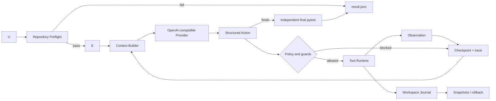

# Architecture

## End-to-end flow



模型只负责选择 action 和生成局部或完整文件修改。Harness 决定模型能看到什么、动作是否合法、工具如何执行、何时停止，以及结果是否可信。

## Module map

| Module | Responsibility |
|---|---|
| `loop.py` | Agent 状态机、终止条件、checkpoint 和事件流 |
| `provider.py` | OpenAI-compatible API、JSON action 解析、格式/网络重试 |
| `context.py` | 有界 prompt、独立 baseline、最近 trace 和稳定进度摘要 |
| `failure_context.py` | 从 baseline traceback 安全提取仓库内源码位置与有界行号片段 |
| `registry.py` | 单一 action schema 来源和参数验证 |
| `permissions.py` | 仓库路径、控制目录和 pytest 参数边界 |
| `tools.py` | 文件、搜索、局部/整文件 patch、pytest 和 Git 工具执行 |
| `workspace.py` | 写前快照、结束哈希、冲突检测和恢复 |
| `budget.py` | request/token 预算、价格估算和 provider 错误分类 |
| `evaluation.py` | 使用持久化验证命令独立运行 baseline/final/post-rollback pytest |
| `storage.py` | 原子保存 latest 与 per-run trace/result |
| `suite.py` | 隔离复制、交错重复 trial、variant 分组统计和聚合报告 |
| `run_manager.py` | 历史 run 查询和事后安全回滚 |
| `preflight.py` | 模型调用前检查解释器、pytest、命令和仓库形态 |
| `execution.py` | 本地或受限 Docker pytest 执行后端 |

## State transitions

```text
running
├── preflight_failed      local environment or verification contract invalid
├── success               final pytest passed after finish
├── verification_failed   model finished but final pytest failed
├── budget_exhausted      step/request/token limit reached
├── stalled               repeated action guard triggered
└── error                 provider or unexpected model failure
```

所有非运行状态都会生成 `result.json`。启用自动回滚时，失败状态保持不变，同时额外记录恢复文件和 post-rollback pytest，避免把“工作区恢复成功”误报成“Bug 修复成功”。

## Trust boundaries

1. 模型输出永远先经过 action schema 验证。
2. 所有路径必须解析到目标仓库内部，`.git/.repofix/.venv` 等控制目录不可访问。
3. 命令工具只接受 pytest；不向模型开放任意 shell。
4. `finish` 不能决定成功，最终状态由独立 pytest 决定。
5. 写入前保留原始字节；恢复前一次性预检全部文件，防止覆盖后续用户修改或半回滚。
6. evaluation suite 使用临时副本，源 fixture 永不被 Agent 修改。

Preflight 不执行仓库代码，也不调用模型。它只检查本地运行前提，并把结果写入同一个 RunState；pytest 缺失或验证命令越权会以 `preflight_failed` 停止，项目元数据或传统测试文件缺失只作为 warning。

Docker backend 的 preflight 会实际连接 daemon、检查指定镜像并在禁网容器中执行 `pytest --version`。测试容器使用只读仓库与根文件系统、临时 `/tmp`、无 capabilities、禁止提权以及 CPU/内存/PID 限制；超时后 Harness 会按唯一容器名强制清理。

Local pytest 和 Git 子进程会从环境中移除 provider 配置及常见凭据变量。Git diff/status 另外禁用 external diff、textconv、fsmonitor、global/system config 和 optional locks。Local backend 仍不是 OS sandbox，只应运行可信仓库；外部源码默认走 Docker。

Token 预算除了检查累计用量，还会根据当前 context 与历史请求估算下一次请求成本。剩余额度不足时不发送请求；如果已有真实文件改动、baseline 失败且独立 final pytest 通过，Harness 可以在预算边界判定成功，而不额外购买一次仅用于 `finish` 的模型请求。

验证命令属于 Harness 状态而不是模型状态。CLI 或 suite 可以选择仓库所需的 pytest 目标；命令会写入 checkpoint，resume 时必须保持一致，并在 baseline、final 和 post-rollback 三个阶段复用。命令解析后以参数数组执行，不经过 shell，且非 pytest 入口会在调用模型前被拒绝。

baseline pytest 在首轮模型请求前执行，其命令、状态和压缩后的头尾输出会固定保留在 context 中。模型因此可以直接根据 traceback 开始定位，不需要先消耗一次 action 重跑完整测试。仓库内容、测试输出和历史 observation 均在 provider prompt 中明确标记为不可信数据。

首轮请求还会解析 baseline 中的 Python 文件位置，并读取少量带行号的上下文。路径必须经过同一仓库边界与控制目录策略，容器路径 `/workspace/...` 会映射回目标仓库，外部依赖栈帧会被忽略；文件去重且总字符数受限。若 traceback 只指向测试文件，Harness 使用 Python AST 解析一跳 import，在仓库根目录、`src/` 或相对 package 中寻找本地模块，并把片段居中到导入符号定义。该过程不会 import 或执行仓库代码，也不会递归展开依赖。完成第一个模型 action 后不再重复注入这些片段，避免后续轮次持续增加 token。

上下文提示明确说明 baseline 与自动附带的源码片段已经构成 inspection evidence，模型只在信息不足时调用 list/read/search。这样 context optimization 才能转化为更短的 action path，而不是提供了源码后仍机械重复读取。

每次真正发起模型 action 前，Harness 会把 context provenance 写入 `RunState.context_snapshots`：包括实际/最大字符数、baseline 是否存在、history 纳入与省略数量，以及自动选择源码的相对路径、原因（traceback 或 local import）、行号、符号和片段长度。这些信息属于 Harness 诊断状态，不加入 Agent history，因此不会改变后续模型决策或额外消耗 token。provider 内部格式/网络重试复用同一 context snapshot。

Evaluation manifest 可以为 task 声明 `repetitions`、`variant` 和 `seed_failure_context`。Runner 按 trial 轮次交错不同 task/variant，每次使用新的 provider 与临时仓库，并为重复项生成独立 artifact ID。报告按 variant 汇总成功率、改动范围，以及 requests/tokens/steps/cost 的 total、mean、median、min 和 max。单个 suite 最多 100 个 trial，避免配置错误造成无界 API 消耗。

Provider 使用两层消息：system 消息只保存不可变的 action 协议、参数 schema 和安全规则；user 消息只承载带边界标记的任务与仓库 context。二者不会拼接到同一角色中，从结构上降低仓库文本覆盖控制指令的风险。

局部 patch 使用精确 `old_text`/`new_text` 协议。只有旧文本在目标文件中唯一出现时才写入；零匹配或多匹配都会作为 observation 返回给模型继续修正。这样不依赖 Git 仓库，也不会让模糊替换静默改错位置。

## Why a custom loop

V1.2 没有使用 LangGraph。当前控制流只有单 Agent、单 action、单 observation，标准 Python 状态机更容易审查、测试和解释。若未来出现并行分支、人工审批节点或分布式持久化，再引入图编排框架才有明确收益。
