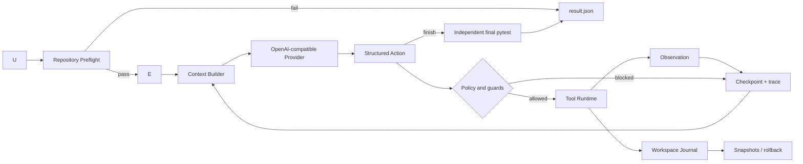

# Architecture

## End-to-end flow



模型只负责选择 action 和生成局部或完整文件修改。Harness 决定模型能看到什么、动作是否合法、工具如何执行、何时停止，以及结果是否可信。

## Module map

| Module | Responsibility |
|---|---|
| `loop.py` | Agent 状态机、终止条件、checkpoint 和事件流 |
| `provider.py` | OpenAI-compatible API、JSON action 解析、格式/网络重试 |
| `context.py` | 有界 prompt、独立 baseline、最近 trace 和稳定进度摘要 |
| `registry.py` | 单一 action schema 来源和参数验证 |
| `permissions.py` | 仓库路径、控制目录和 pytest 参数边界 |
| `tools.py` | 文件、搜索、局部/整文件 patch、pytest 和 Git 工具执行 |
| `workspace.py` | 写前快照、结束哈希、冲突检测和恢复 |
| `budget.py` | request/token 预算、价格估算和 provider 错误分类 |
| `evaluation.py` | 使用持久化验证命令独立运行 baseline/final/post-rollback pytest |
| `storage.py` | 原子保存 latest 与 per-run trace/result |
| `suite.py` | 隔离复制、顺序评测和聚合报告 |
| `run_manager.py` | 历史 run 查询和事后安全回滚 |
| `preflight.py` | 模型调用前检查解释器、pytest、命令和仓库形态 |

## State transitions

```text
running
├── preflight_failed      local environment or verification contract invalid
├── success               final pytest passed after finish
├── verification_failed   model finished but final pytest failed
├── budget_exhausted      step/request/token limit reached
├── stalled               repeated action guard triggered
└── error                 provider or unexpected model failure
```

所有非运行状态都会生成 `result.json`。启用自动回滚时，失败状态保持不变，同时额外记录恢复文件和 post-rollback pytest，避免把“工作区恢复成功”误报成“Bug 修复成功”。

## Trust boundaries

1. 模型输出永远先经过 action schema 验证。
2. 所有路径必须解析到目标仓库内部，`.git/.repofix/.venv` 等控制目录不可访问。
3. 命令工具只接受 pytest；不向模型开放任意 shell。
4. `finish` 不能决定成功，最终状态由独立 pytest 决定。
5. 写入前保留原始字节；恢复前一次性预检全部文件，防止覆盖后续用户修改或半回滚。
6. evaluation suite 使用临时副本，源 fixture 永不被 Agent 修改。

Preflight 不执行仓库代码，也不调用模型。它只检查本地运行前提，并把结果写入同一个 RunState；pytest 缺失或验证命令越权会以 `preflight_failed` 停止，项目元数据或传统测试文件缺失只作为 warning。

验证命令属于 Harness 状态而不是模型状态。CLI 或 suite 可以选择仓库所需的 pytest 目标；命令会写入 checkpoint，resume 时必须保持一致，并在 baseline、final 和 post-rollback 三个阶段复用。命令解析后以参数数组执行，不经过 shell，且非 pytest 入口会在调用模型前被拒绝。

baseline pytest 在首轮模型请求前执行，其命令、状态和压缩后的头尾输出会固定保留在 context 中。模型因此可以直接根据 traceback 开始定位，不需要先消耗一次 action 重跑完整测试。仓库内容、测试输出和历史 observation 均在 provider prompt 中明确标记为不可信数据。

Provider 使用两层消息：system 消息只保存不可变的 action 协议、参数 schema 和安全规则；user 消息只承载带边界标记的任务与仓库 context。二者不会拼接到同一角色中，从结构上降低仓库文本覆盖控制指令的风险。

局部 patch 使用精确 `old_text`/`new_text` 协议。只有旧文本在目标文件中唯一出现时才写入；零匹配或多匹配都会作为 observation 返回给模型继续修正。这样不依赖 Git 仓库，也不会让模糊替换静默改错位置。

## Why a custom loop

V1.0 没有使用 LangGraph。当前控制流只有单 Agent、单 action、单 observation，标准 Python 状态机更容易审查、测试和解释。若未来出现并行分支、人工审批节点或分布式持久化，再引入图编排框架才有明确收益。
